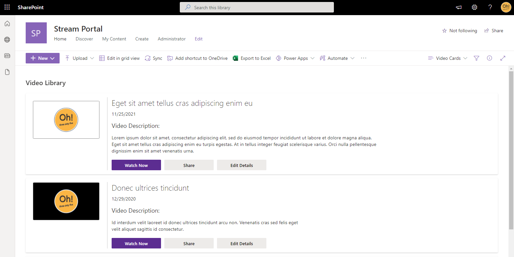
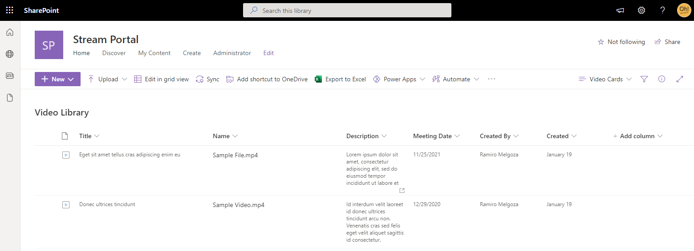

## View Formatting Screenshot

## List Details Screenshot

## View requirements

|Type|Internal Name|Required|
|---|---|:---:|
|Single line of text|Title|No|
|Multiple lines of text|Description|No|
|Meeting Date|Date and Time|No|

## Additional notes

- This list view has some accomodations for missing field entries, where some will take precedence over others.

  - ` Filename ` will be used if ` Title ` is blank.
  - ` Created ` will be used if ` Meeting Date ` is blank.

- As configured, the 'Edit Details' button will only become visible for the ` Author ` of the file.
